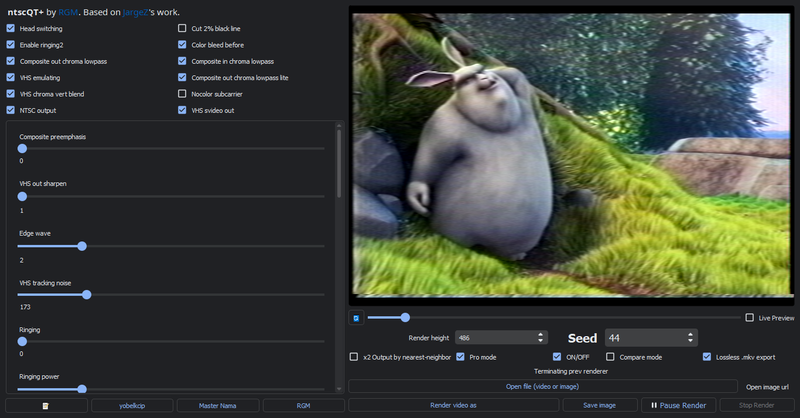

<p align="center">
   
</p>

<p align="center">
   An analog video emulator in only <b>ONE</b> executable.<br>Based on <a href="https://github.com/JargeZ/ntscqt">JargeZ</a> and <a href="https://github.com/zhuker/ntsc">zhuker</a>'s work.
</p>

<div align="center">

<!-- [](https://github.com/JargeZ/ntscqt/releases/latest)
[](https://github.com/JargeZ/ntscqt/releases/latest) -->
[](https://github.com/JargeZ/ntscqt/commits)
[](https://github.com/JargeZ/ntscqt/commits)
<!-- [](https://0hz.ru/ntscqt/) -->

</div>

<hr />

:vhs:

**ntscQT+**, based on a tool created by [**JargeZ**](https://github.com/JargeZ/ntscqt) and a script by [**zhuker**](https://github.com/zhuker/ntsc), is a application that uses [**Python**](https://www.python.org/) and [**OpenCV**](https://opencv.org/) to create a simulation of analog video. Essentially, you can simulate VHS/analog video in a **REALISTIC** way, without cheap and unrealistic effects!

---




<div align="center">

## ❓ What changed?

Let's address that changed since the last original ntscQT release.

- **New** ***dark*** interface.
- New **parameters** and **video** ***artifacts***.
- You can import and export presets on **JSON** files.
- A lossless [FFV1](https://en.wikipedia.org/wiki/FFV1)/[Matroska](https://www.matroska.org/) rendering function.
- **Better** image detail and **interlacing**, for a **best** simulation.

## :video_camera: Demo

*There is a full section of videos and things that used the original **ntscQT**.*

[](https://youtu.be/hV9IoedRe7I)
[](https://youtu.be/S6Qn-_wWuMc)

[](https://youtu.be/M7vZqABy85M)

[](https://youtu.be/uqT3Z0kfF24)
[](https://youtu.be/Jr7Jmn81WNQ)
[](https://youtu.be/TMZathtFWM8?t=377)
[](https://youtu.be/FPcTfAHiPyw)
[](https://youtu.be/k5l16rJfh-8)
[](https://youtu.be/vjvISSdGYv0)
[](https://youtu.be/ctMSn--04Sk)

</div>

## :floppy_disk: Installation

*At the moment, there is no release of **ntscQT+**, but you can find older versions of the original **ntscQT** in [JargeZ/ntscQT](https://github.com/JargeZ/ntscqt).*

*If you want to use **ntscQT+**, you can compile using the instructions below.*

<!-- <div align="center">

## :floppy_disk: Installation

[](https://github.com/JargeZ/ntsc/releases/latest/download/ntscQT.exe)
[](https://github.com/JargeZ/ntsc/releases/latest/download/ntscQT.exe)

You can [download latest version here](https://github.com/JargeZ/ntsc/releases/latest/download/ntscQT.exe) or from [releases page](https://github.com/JargeZ/ntsc/releases)

</div> -->

## :computer: Compiling

#### Requisites
- Python
- Powershell *(recent version, needed for Windows users)*

#### For Windows

1. Open your terminal. *(Recommended: [Windows Terminal](https://github.com/microsoft/terminal))*
2. Install a package manager. *(Recommended: [Scoop](https://scoop.sh/) and [Chocolatey](https://chocolatey.org/))*
3. Install Python. *(In case you don't have)*
   ```powershell
   # Chocolatey
   choco install python
   # Scoop
   scoop install python
   ```
4. Install Git. *(Needed for cloning the repo)*
   ```powershell
   # Chocolatey
   choco install git
   # Scoop
   scoop install git
   ```
5. Install FFMPEG. *(Necessary)*
   ```powershell
   # Chocolatey
   choco install ffmpeg
   # Scoop
   scoop install ffmpeg
   ```
6. Clone the repo:
   ```powershell
   git clone https://github.com/rgm89git/ntscQTplus.git
   cd ntscQTplus
   python -m venv ./venv
   ./venv/Scripts/activate
   pip install -r requirements.txt
   ```
7. Create and activate a virtual environment:
   ```powershell
   python -m venv ./venv
   ./venv/Scripts/activate.ps1
   ```
8. Install the requirements:
   ```powershell
   pip install -r requirements.txt
   ```
9. Run the script:
   ```powershell
   python ntscQT.py
   ```
9. After exiting, you should run the script by entering the following command:
   ```powershell
   ./venv/Scripts/activate.ps1 && python ntscQT.py
   ```
10. If you want to compile an executable, install [PyInstaller](https://www.pyinstaller.org/) and use it.
   ```powershell
   pip install pyinstaller
   pyinstaller ntscQT.spec
   ```

#### For Mac OS X and Linux

Thanks for [Robot Riot Records](https://linktr.ee/robotriot) for donation which motivated to make MacOS fixes
1. Open your terminal of preference.
2. **For Mac OS users:** If not already installed, install Homebrew: [brew.sh](https://brew.sh/)
3. Install FFMPEG *(necessary)*:
   ```bash
   brew install ffmpeg # For Linux users: use package manager of distribution you're using to download and install FFmpeg
      # --- LINUX SPECIFIC PACKAGES ---
   sudo apt install libxcb-xinerama0 # use package manager of distribution you're using to download and install this list of packages
   ```
4. Clone the repo:
   ```bash
   git clone https://github.com/rgm89git/ntscQTplus.git
   cd ntscQTplus
   ```
5. Create and activate a virtual environment:
   ```bash
   python3 -m venv ./venv
   source venv/bin/activate
   ```
6. Install the requirements:
   ```bash
   pip install -r requirements.txt
   ```
7. Run the script:
   ```bash
   python ntscQT.py
   ```
8. After exit and subsequent times, you should run app by entering the following command:
   ```bash
   cd ~/ntscqt && venv/bin/python ntscQT.py
   ```

#### For Mac on M1 Apple Silicon

```bash
brew install pyqt@5
git clone https://github.com/rgm89git/ntscQTplus.git
cd ntscQTplus
python3 -m venv ./venv
cp -R /opt/homebrew/Cellar/pyqt@5/5.15.6/lib/python3.9/site-packages/* ./venv/lib/python3.9/site-packages/
source venv/bin/activate
pip install --pre -i https://pypi.anaconda.org/scipy-wheels-nightly/simple scipy
pip install --ignore-installed -r requirements.m1-temp.txt
venv/bin/python ntscQT.py
```

<p align="center">
	An fork made with love by <a href="https://rgmneocities.neocities.org/"> RGM </a>, in :br:
   <h6><i>Website above in Portuguese</i></h6>
</p>

### About ntscQT+ on Termux 
*At this moment ntscQT+ is **not supported on Termux even with proot-distro utility**. Maybe ntscQT+ is runnable on Termux but **there is no method to make it work**.*

## NOTE
`This code is *SLOW*. It's designed to be as accurate as I can make it, not fast. You may want to take any Simpsons episodes you will be editing and cut them up first in Adobe Premiere (or your favorite video editor) then run the exported "clip show" through this program instead of wasting CPU cycles on whole episodes.`

<!-- ## :vhs: Usage
You can open the video and experiment with all parameters
- **Seed** field generates random processing parameters that will always be the same for the same value
- **Preview height** indicates the size of the frame that is processed for preview. Less is faster.
- The **Render height** initially becomes the same as the video you uploaded. If you set the value less, the video will be resized and processed faster
- **Pause Render** allows you to pause the render and change the processing parameters to achieve a variable effect in the video. Also, the sliders can be turned directly during rendering without pause.
- **LivePreview** can be turned on during rendering, then every frame being processed will be shown in the preview window, default only every 10th frame shown
- **:arrows_counterclockwise: button** re-render the current frame effect -->

## Thanks

I want to thanks these people.

- [**JargeZ**](https://github.com/JargeZ) for the original **ntscQT**.
- [**zhuker**](https://github.com/zhuker) for the original [Python port](https://github.com/zhuker/ntsc).
- [**joncampbell123**](https://github.com/joncampbell123) for the original [C++ script](https://github.com/joncampbell123/composite-video-simulator).
- [**5yutan5**](https://github.com/5yutan5) for the new [theme](https://github.com/5yutan5/PyQtDarkTheme).

<hr />

#
##### Original README *(from zhuker's ntsc script)*

#### NTSC video emulator


This is a python3.6 rewrite of https://github.com/joncampbell123/composite-video-simulator
intended for use in analog artifact removal neural networks but can also be used for artistic purposes

The ultimate goal is to reproduce all of the artifacts described here
https://bavc.github.io/avaa/tags.html#video

At this point simulated artifacts include 

# Dot crawl
A composite video artifact, dot crawl occurs as a result of the multiplexing of luminance and chrominance information carried in the signal. Baseband NTSC signals carry these components as different frequencies, but when they are displayed together, the chroma information can be misinterpreted as luma. The result is the appearance of a moving line of beady dots. It is most apparent on horizontal borders between objects with high levels of saturation. Using a comb filter to process the video can reduce the distraction caused by dot crawl when migrating composite video sources, and the artifact may be eliminated through the use of s-video or component connections. However, if it is present in an original source transfer, it might be compounded in subsequent generations of composite video transfers.


# Ringing
In a general sense, ringing refers to an undesirable oscillation exhibited in a signal. This video artifact is common to recordings created using less sophisticated, early model cameras and VTR equipment (particularly early U-matic equipment). It can be accentuated by over-enhancement or sharpening of the image using processing hardware or CRT monitor controls. When recorded in the signal on tape, it becomes part of the image.


# Chroma/Luma Delay Error aka Color Bleeding

When video suffers from Y/C delay error, there will be a mismatch in the timing among the luminance and/or color channels, with resulting visible misalignment in how colors appear in the monitor. A misalignment of Y/C shows a blurry edge around areas with high contrast color difference, and will be most apparent around sharp edges of objects in the video image.

 

# Rainbow effects
Rainbow effects and dot crawls are caused by imperfect separation of the luma and chroma components of a composite video signal. This effect is called color crosstalk. It is most noticeable on computer generated images like subtitles, weather maps, stationary logos and video images where you have hi-frequency data (like the shot of a skyscraper in the distance). Whenever you have strong alternating, fine patterns (= high frequencies) in luma, you have rainbow effects. Whenever you have a sudden, big change in chroma (typically computer generated graphics etc.), you have dot crawls. The technical terms are as follows: rainbow effects is cross color (hi-frequency luma data upsets the chroma demodulator) and dot crawl is cross luminance (chroma leftovers in the Y signal).


# Chrominance Noise
Chrominance noise can be identified as traces and specks of color in an otherwise clear picture. It is most visible in dark, saturated areas of the video image. It can be due to limitations of CCD sensitivity in video cameras (i.e., low-lighting conditions during camera recording), over-boosting of chrominance in the video signal, or the use of poor video processors. Multi-generation composite dubs may suffer from high levels of chrominance noise.


# Head Switching Noise
Head switching noise is commonly seen at the bottom of video display during VHS playback. Although it occurs in other formats, it is often masked depending on the processing features and calibration of the playback VTR. During playback of videotape, video heads are turned on as they pass over the media and then turned off to prevent the display of noise that would be output when they are not in contact with the tape. Head switching noise is a result of that switching interval, and it occurs prior to the start of vertical sync. This artifact is not viewable in overscan on a broadcast monitor, but it is viewable in underscan and in full-raster digitized video and un-cropped digital derivatives. Some VTRs feature “SWP masking”, which effectively masks the lines created during head switching with video black.


# Long/Extended Play
Long Play (LP) mode, available for a variety of video formats (see list below), makes it possible to extend the potential recording time of a tape by lowering the tape speed and changing the angle and proximity of the recorded tracks. For proper playback, a recording made in LP mode must be played back in LP mode.

If played back in Standard Play (SP) mode, the image is still recognisable, but—depending on the format—may be played back between 1.5x and 2x too fast, displaying irregular, horizontal, bands of noise similar to those that appear when fast-forwarding. Audio on the longitudinal track will sound too high-pitched, and will be played back so fast that the speech sounds incomprehensible. If FM or PCM audio is recorded on the helical tracks, it will drop out completely.
LP mode was effectively replaced with EP (“extended play”) or SLP (“super long play”). Often referred to together as “EP/SLP”, this mode involves tape speed 3x slower than standard play speeds.

In cases where the tape speed is slowed to economize on media usage, less information is recorded for a given image, resulting in noticeably reduced picture quality. Generally speaking, when tape speed is reduced, any other condition afflicting the tape, such as stiction or stretching, is further exacerbated.

# Luminance Noise
Luminance noise manifests itself in a video picture as light white noise. It may be the result of electronic failure, recording in low-light, worn or poorly coated tape stock, transmission of a video signal over cables that are too long, over-enhancement of the video signal, or dirty record or playback heads. Color video or black and white video can both contain luminance noise.

# OVERSATURATION
Oversaturation refers to high chrominance amplitude in a video signal, creating the appearance of very intense color in the image. Depending on severity of oversaturation, color in the image may appear to bleed into areas outside of an object’s apparent boundaries. Most NTSC broadcast standards require that the composite video signal not exceed 120 IRE (flat). SMPTE split field color bars use 75% saturation as the maximum value for calibration, although there are other patterns used for testing which contain 100% saturation values.


